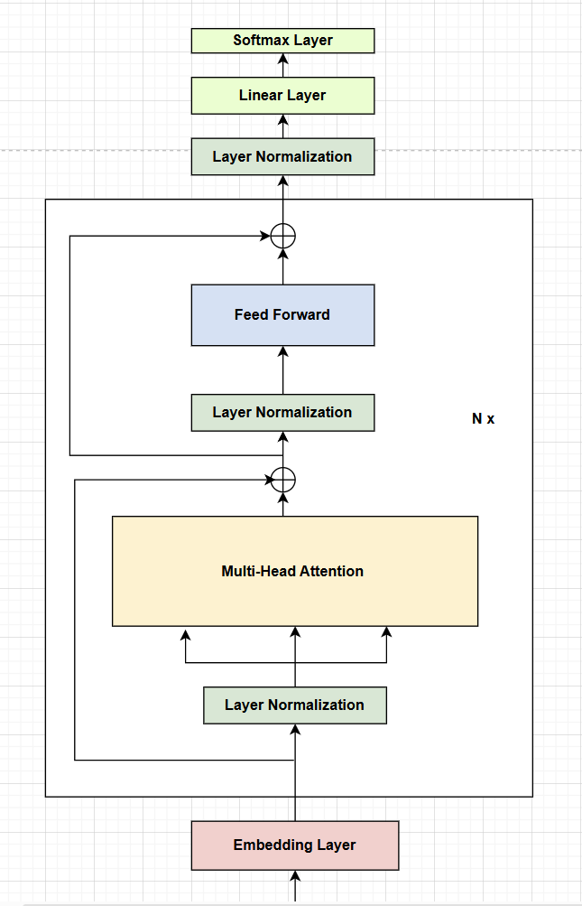

## **Building GPT**
This repo is referenced from the [build-nanogpt](https://github.com/karpathy/build-nanogpt) by Andrej Karpathy. Thanks!

Fig a. GPT architecture

### **Papers 📄**  
I am reading these papers:  
✅ [Language Models are Unsupervised Multitask Learners](https://cdn.openai.com/better-language-models/language_models_are_unsupervised_multitask_learners.pdf)  
✅ [Language Models are Few-Shot Learners](https://arxiv.org/pdf/2005.14165)  
✅ [Attention is All You Need](https://arxiv.org/abs/1706.03762)  
✅ [Gaussian Error Linear Units (GELUs)](https://arxiv.org/abs/1606.08415)  
✅ [Using the Output Embedding to Improve Language Models](https://arxiv.org/abs/1608.05859)  
☑️ [FlashAttention: Fast and Memory-Efficient Exact Attention with IO-Awareness](https://arxiv.org/abs/2205.14135)  
☑️ [FlashAttention-2: Faster Attention with Better Parallelism and Work Partitioning](https://arxiv.org/abs/2307.08691)  
☑️ [Online normalizer calculation for softmax](https://arxiv.org/abs/1805.02867)  

### **Goals 🎯**
✅ Read the [GPT-2 paper](https://cdn.openai.com/better-language-models/language_models_are_unsupervised_multitask_learners.pdf) for baseline of the model architecture.  
✅ Inspect the source code of the GPT-2 model from OpenAI & HuggingFace.  
✅ Prepare a notebook to experiment the model and outputs as done by Andrej Karpathy.  
✅ Implement the GPT-2 model from scratch with diagrams and explanations.  
✅ Implement the transformer block of the model with attention & FFN.  
✅ Read the [GELU paper](https://arxiv.org/abs/1606.08415) for activation function used in GPT2.  
✅ Implement the FeedForwardBlock of the model with GELU activation.  
✅ Implement the MultiHeadAttentionBlock of the model from scratch.  
✅ Load the GPT-2 model checkpoints from HuggingFace using custom GPT architecture class.  
✅ Implement the inference script to generate text from the model.  
✅ Implement the data loading pipeline for the model and play with the data.  
✅ Work on initializing the random weights as mentioned in GPT-2 paper.  
✅ Learn and understand the concept of weight tying in the Transformer model.  
✅ Read the [Automatic Mixed Precision](https://pytorch.org/tutorials/recipes/recipes/amp_recipe.html) for enabling mixed precision training and automatic type casting.    
✅ Enable the mixed precision training (TF32 & BF16) in the model training.  
✅ Read the documentation of [torch.compile](https://pytorch.org/tutorials/intermediate/torch_compile_tutorial.html) from PyTorch.  
✅ Implement and understand global gradient clipping in the model training.  
✅ Implement and understand the learning rate scheduling in the model training.  
✅ Implement and understand the weight decay using AdamW optimizer and fused optimizer.   
☑️ Code the training script for GPT-2 model.  
☑️ Work on optimization and training the model on a example dataset.  

### **Github Repositories**
🌐 [nanoGPT](https://github.com/karpathy/nanoGPT) - Implementation by Andrej Karpathy.  
🌐 [build-nanogpt](https://github.com/karpathy/build-nanogpt) - Implementation by Andrej Karpathy.    
🌐 [gpt-2](https://github.com/openai/gpt-2) - TensorFlow implementation of GPT-2 by OpenAI.  
🌐 [modeling-gpt2](https://github.com/huggingface/transformers/blob/main/src/transformers/models/gpt2/modeling_gpt2.py) - PyTorch implementation of GPT-2 by HuggingFace.  
🌐 [Meta-llama](https://github.com/ThinamXx/Meta-llama/tree/main) - Implementation of Llama by Thinam Tamang.  
🌐 [flash-attention](https://github.com/Dao-AILab/flash-attention) - Implementation of Flash Attention by Tri Dao.  

### **Important Notes 🍀**
💡 If we have a pretrained model, we can plot the weights of the positional embeddings + the weights of the token embeddings. If we see a lots of fluctuations and noise with the weights, then the model is not trained completely or the model is not converged yet. So, if the plot is smooth, then the model is trained well.  

💡 We can calculate the reasonable starting point for the randomly initialized weights of the model by using the vocabulary size and the loss function used in the model. In this work on GPT2, the vocabulary size is 50257 and every vocab element is getting roughly 1/50257 probability of being selected which means that we are getting -log(1/50257) = 10.82 loss if we randomly initialize the weights keeping in mind that the cross entropy loss is used in the model. The cross entropy loss is the negative log likelihood of the true class. So, the loss should be around 10.82 if the model is randomly initialized.  

💡 The input embeddings at the bottom of the Transformer and the output embeddings coming from the linear or projection layer at the top, contains 2D tensors exactly of same shape and elements pointing to the same data pointer. This is known as weight tying scheme with the intuition that if two tokens are very similar semantically then we would expect them to have similar probabilities at the output of the Transformer. You can find this implementation in original [GPT2 source code](https://github.com/openai/gpt-2/blob/master/src/model.py#L171C8-L171C58) from OpenAI. 